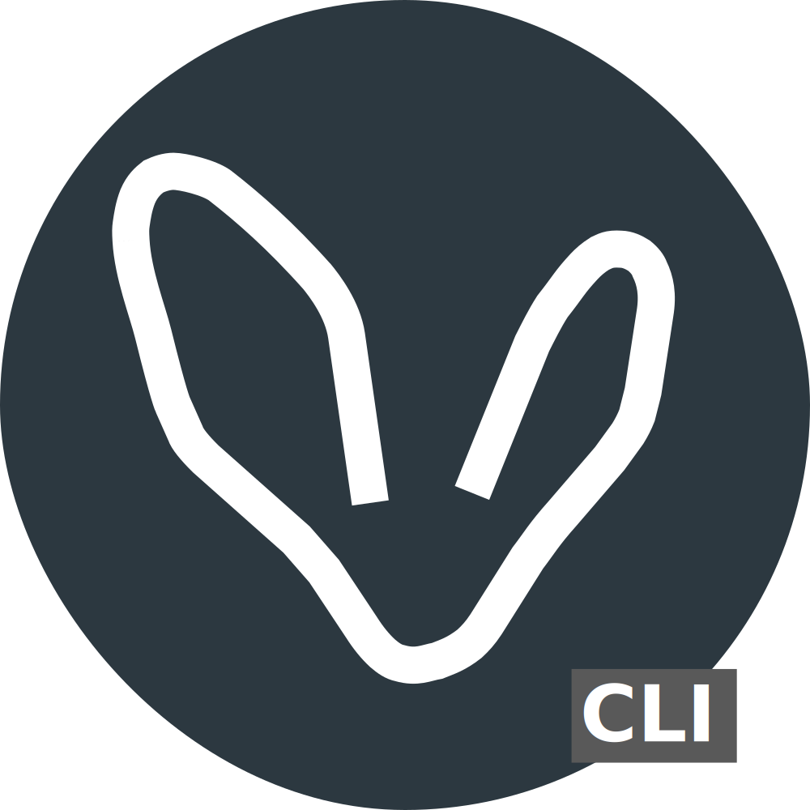

# amadla-cli

[![Build Status][build_status_badge]][build_status_link] 

Amadla-cli is the tool for the handling of entity configuration files.

## :books: Documentations
          :card_index_dividers: [html](https://amadla.org/amadla-cli/docs/latest/html/en/)

          :briefcase: [pdf](https://amadla.org/amadla-cli/docs/latest/pdf/en/)

          :green_book: [epub](https://amadla.org/amadla-cli/docs/latest/epub/en/)

          :memo: [wiki](https://github.com/AmadlaOrg/amadla-cli/wiki)

          :open_book: [readthedocs](https://amadla-cli.readthedocs.io/en/latest/)

### :fleur_de_lis: Why is the documentation also in French?

          Our *127.0.0.1* is in Québec :fleur_de_lis:, Canada 🇨🇦 for this reason we have to provide our [documentation in French](./README.fr.md).

## :label: Terminologies
          [IaC](https://en.wikipedia.org/wiki/Infrastructure_as_code) - Infrastructure as Code.

          [Amadla](https://amadla.org/) - Just a made up name, but it is similar to the [Nguni](https://en.wikipedia.org/wiki/Nguni_languages) word for power and strength [*Amandla*](https://en.wikipedia.org/wiki/Amandla_(power)).

## :heavy_check_mark: Credits & Acknowledgements

           <a href="https://github.com/jnbdz"><strong>jnbdz</strong> JN Σ</a> - Founder, Python developer and IaC developer

           <a href="https://github.com/ianbenlolo"><strong>ianbenlolo</strong> Ian Benlolo</a> - Python developer and reviewer

           <a href="https://github.com/alxcvdo7"><strong>alxcvdo7</strong> Sharon-Alexa Acevedo</a> - Python developer (unit tests)

## :scroll: Copyright and License

The license for the code and documentation can be found in the [LICENSE](./LICENSE) file.

---

Made in Québec :fleur_de_lis:, Canada 🇨🇦!
